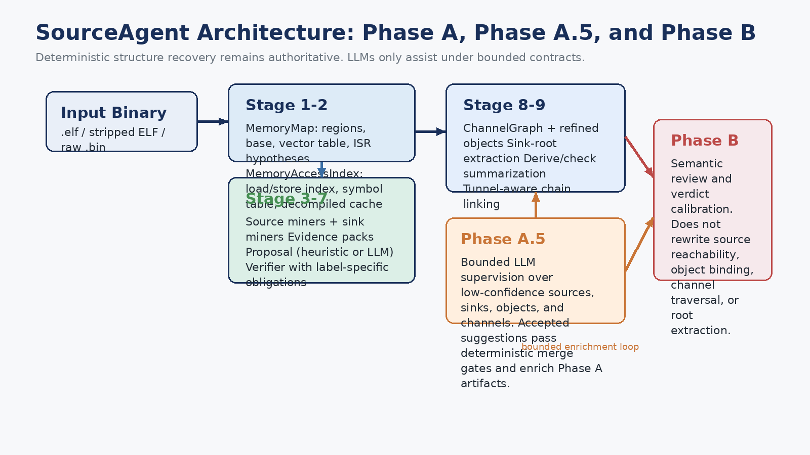
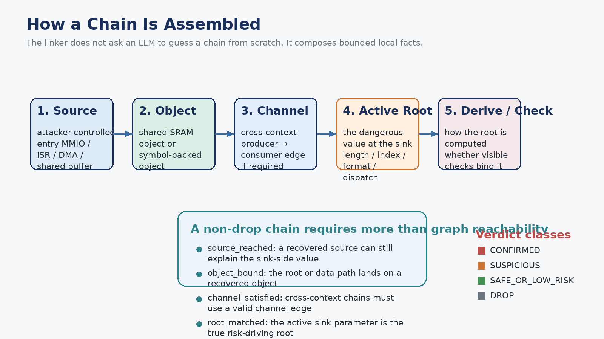
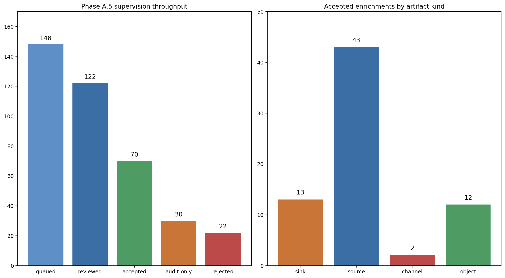
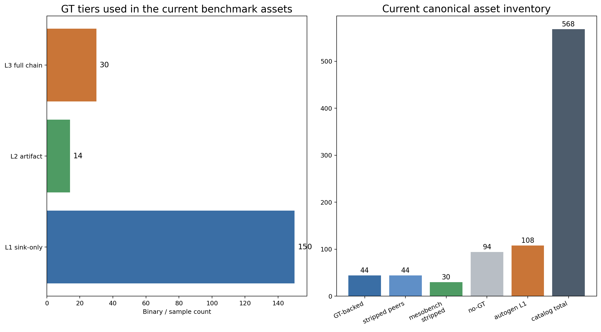
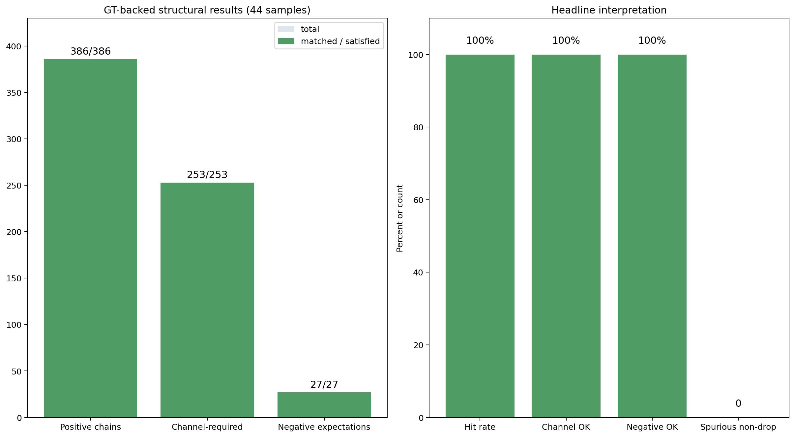
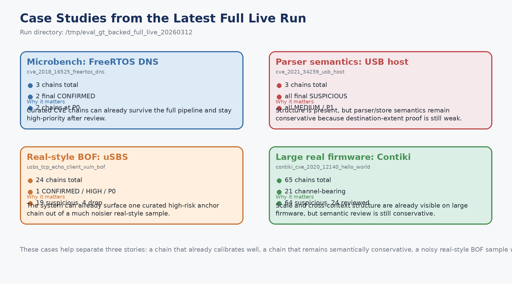
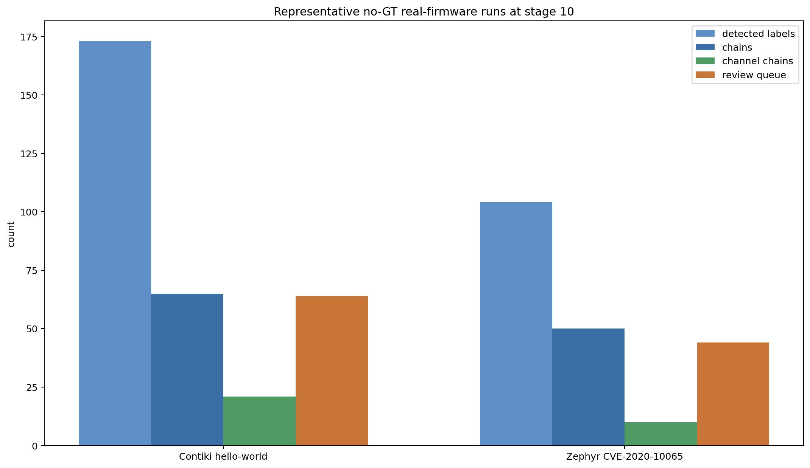

# SourceAgent 进度汇报

日期：2026 年 3 月 12 日

这份文档是 `docs/progress_report_20260312_en.pptx` 的中文版配套说明。

它面向进度汇报场景，重点回答：

- SourceAgent 现在到底在恢复什么
- Phase A、Phase A.5、Phase B 分别做什么
- chain 是如何拼出来的
- benchmark 资产和 GT 是如何构建的
- 当前已经可以有把握地宣称什么
- 还缺什么没有做完

## 1. 一页总结

SourceAgent 现在已经不只是一个 source/sink label detector。

当前系统正在演化成一个面向 Type-II/III monolithic firmware 的两阶段分析框架：

- **Phase A**：做 deterministic、fail-closed 的结构恢复
- **Phase A.5**：对低置信结构做 bounded LLM supervision
- **Phase B**：做 semantic review 和 risk calibration，但不重写 Phase A 的事实

当前最强的结果是：

**在 44 个 GT-backed baseline 上，结构化 chain recovery 已经非常强。**

当前最大的剩余问题已经不是“能不能拼出链”，而是：

- verdict calibration
- stripped/raw 条件下的鲁棒性
- 以及在更广泛 real firmware 上的 benchmark 级有效性证明

## 2. 为什么这个问题必须做结构恢复

目标不是 Linux 风格的软件，而是 **monolithic firmware**。

在这种场景里：

- 输入常常通过 **MMIO**
- 数据可能先由 **ISR** 或 **DMA** 写入
- 危险 sink 可能在后续、另一个 context 中才出现
- 真正驱动风险的，往往不是整个 object，而是某个特定 **root**，比如 length、index、format string 或 dispatch selector

所以只找到 sink 是不够的。

要解释一条真实 chain，至少需要恢复：

- `source`
- `sink`
- `object`
- `channel`
- `sink_root`
- `derive/check`

这几类就是当前系统显式建模的核心结构单元。

在 GT 文档里，这些核心结构会进一步展开成更完整的 benchmark schema，例如：

- `sources`
- `objects`
- `channels`
- `sinks`
- `sink_roots`
- `derive_checks`
- `chains`
- `negative_expectations`

## 3. 整体架构



### 3.1 Phase A

Phase A 是 deterministic 的核心。

它大体按下面顺序运行：

1. `MemoryMap` 恢复
2. `MemoryAccessIndex` 构建
3. source mining
4. sink mining
5. evidence packing
6. proposal
7. verifier
8. ChannelGraph 和 object refinement
9. sink-root extraction、derive/check summarization、chain linking
10. triage 和 verdict-calibration artifacts

### 3.2 Phase A.5

Phase A.5 是一个 **可选的 bounded supervision loop**。

它的职责 **不是** 从零开始找漏洞。

它的职责是增强那些低置信、语义模糊的 Phase A artifact，例如：

- stripped binary 里较弱的 sink candidate
- 被 wrapper 包裹住的 source candidate
- 边界不清晰的 object hypothesis
- 证据偏弱的 channel hypothesis

它的核心规则是：

> LLM 可以提出建议，但最终必须通过 deterministic merge gates

所以 supervision 可以增强 Phase A 的输出，但不能取代 Phase A 作为 deterministic authority 的地位。

### 3.3 Phase B

Phase B 是 semantic review 层。

它消费的是 Phase A 已经产出的 chain artifacts，并回答受限的语义问题，例如：

- 可见 check 是否真的 bind 了 active root？
- attacker 在 sink 处是否仍然控制这个 root？
- 这条链更应该被判成 `SAFE_OR_LOW_RISK`、`SUSPICIOUS` 还是 `CONFIRMED`？
- 最终 risk band 和 review priority 应该是什么？

Phase B **不能** 重新决定：

- source reachability
- object binding
- channel traversal
- root extraction

## 4. 一些核心术语的含义

### 4.1 Deterministic

“Deterministic” 指的是核心结构恢复路径不依赖开放式生成。

对于同一个 binary、同一套配置，主要的结构化输出应当可重复复现。

### 4.2 Fail-closed

“Fail-closed” 指的是证据不足时，不会升级成更强的结论。

例如：

- 如果 source proposal 没通过 required obligations，它就不会变成可信 source label
- 如果 sink root 抽不出来，这条 chain 只能保持 partial 或 weak 状态
- 如果一条链必须依赖 channel，但 channel 不成立，这条链应该被 drop

### 4.3 `MemoryMap`

`MemoryMap` 是 Stage 1 的地址空间模型。

它记录：

- base address
- entry point
- flash / SRAM / MMIO regions
- vector table
- ISR handler hypotheses

它回答的问题是：

> 这个 firmware binary 所处的地址空间长什么样？

### 4.4 `MemoryAccessIndex`

`MemoryAccessIndex` 是 Stage 2 的访存索引。

它记录：

- loads 和 stores
- 可恢复时的 target address
- base expression 的 provenance
- function / ISR context
- global symbols
- decompiled code cache

它回答的问题是：

> 谁在什么上下文中读写了哪些地址？

### 4.5 Proposal 和 verifier

Stage 6 的 proposal 会给每个 evidence pack 产生一个 candidate label。

在最便宜的路径里，这个 proposal 其实就是 miner hint。

Stage 7 的 verifier 则会检查 **label-specific obligations**。

例如：

- `MMIO_READ`：constant-base evidence 和 peripheral-range evidence
- `ISR_MMIO_READ`：MMIO evidence 加 ISR-context evidence
- `COPY_SINK`：callsite match 加 argument extraction
- `FORMAT_STRING_SINK`：printf-like sink 加 non-literal format argument

Verifier 故意放在 **chain linking 之前**，因为系统希望先把局部 source/sink 事实清洗干净，再把它们组合成更大的结构。

### 4.6 Chain verdict

系统里其实有两套不同层次的 “verdict”：

1. **label verifier verdict**
   - `VERIFIED`
   - `PARTIAL`
   - `REJECTED`
   - `UNKNOWN`
2. **chain verdict**
   - `CONFIRMED`
   - `SUSPICIOUS`
   - `SAFE_OR_LOW_RISK`
   - `DROP`

Stage 10 还会增加 side-band risk 输出，例如：

- `LOW / MEDIUM / HIGH`
- `P0 / P1 / P2`

### 4.7 Stage 10 artifacts

Stage 10 会把主要面向 reviewer 和 risk 的产物固化下来。

最重要的几个文件是：

- `triage_queue.json`
  - 最高优先级、值得人工关注的 suspicious chains
- `verdict_feature_pack.json`
  - 面向 semantic review 的每条链的 deterministic fact bundle
- `verdict_calibration_queue.json`
  - 真正被选中送去 semantic review / calibration 的子集
- `verdict_soft_triage.json`
  - 合并 strict verdict、soft review 状态、final risk band 和 review priority 后的最终输出

所以如果有人问“semantic / risk-facing output 是从哪里开始的”，最简洁的回答就是：

> Stage 10 把已经拼好的结构链条，转成 reviewer-facing 和 calibration-facing 的 JSON 合同

## 5. Chain 是怎么拼出来的



最重要的一点是：SourceAgent **不是** 让 LLM 从头“猜整条链”。

相反，它是在组合局部事实：

1. 找到真实的 `source`
2. 把路径绑定到某个 `object`
3. 如果是跨上下文路径，就要求满足 `channel`
4. 确认 active `sink_root`
5. 汇总 `derive/check` facts
6. 产出 chain verdict

所以核心问题不是：

> 图上有没有一条路径？

而是：

> 这是不是一条 source-reached、object-bound、root-matched、channel-satisfied、derive/check-explained 的链？

这也是为什么 chain-level 指标比 raw artifact precision 更有意义。

## 6. Phase A.5 supervision 到底在做什么

Phase A.5 是最容易在口头汇报里被讲得不够清楚的部分。

最准确的表述是：

> 它是 late Phase A 内部的一个 bounded enrichment loop

它会拿低置信、语义模糊的 item 去请求 structured supervision decision，然后这些 decision 再经过 deterministic merge gates。

Supervision queue 里的 item 可以来自：

- sinks
- sources
- objects
- channels

当前实现里已经会写出并使用这些 artifact：

- `supervision_queue.json`
- `supervision_decisions.json`
- `supervision_prompt.json`
- `supervision_raw_response.json`
- `supervision_session.json`
- `supervision_trace.json`
- `supervision_merge.json`

### 6.1 为什么需要 Phase A.5

它在 deterministic miner 失去语义清晰度时最有价值，尤其是：

- stripped ELF
- wrappers / thunks
- loop-based sinks
- 边界不清晰的 object / channel

### 6.2 它不能做什么

它 **不能**：

- 替代 binary lifting
- 发明 entry point
- 猜 raw binary 的 base address
- 从零开始宣布一条完整漏洞链

它必须始终锚定在 Phase A 已经产生的 deterministic candidate 上。

### 6.3 当前 supervision 的实验信号

根据当前 supervision summary：

- queue total: `148`
- reviewed total: `122`
- accepted total: `70`
- audit-only total: `30`
- rejected total: `22`

按 artifact kind 看，accepted enrichments 分布为：

- `source`: `43`
- `sink`: `13`
- `object`: `12`
- `channel`: `2`

这个结果的解释是：

- source/sink supervision 已经明显有用
- object/channel supervision 已经接上且可测量
- 但 object/channel merge gate 目前仍然刻意保持保守



### 6.4 Phase A.5 在当前实现中挂在哪里

从概念上说，Phase A.5 位于 **deterministic artifact recovery 之后、最终 semantic calibration 之前**。

在当前实现里，它表现为一个 **late Phase A enrichment loop**：

1. 先构建初始的 Phase A artifacts
2. 生成 `supervision_queue.json`
3. 用 supervision model 跑这些 bounded suspicious items
4. 应用 deterministic merge gates
5. 用 accepted enrichments 重建受影响的 Phase A artifacts
6. 再继续进入最终的 Stage 10 calibration outputs

所以最合适的描述是：

> 它是 late Phase A 内部的一个 bounded feedback loop，不是第二个 reviewer

## 7. Benchmark 资产和 GT 分层

当前 benchmark 资产已经是分层的。

### 7.1 L1 sink-only GT

这是最可扩展的那一层。

它记录 sink location 和 sink label。

主要用途：

- 严格的 TP/FP/FN sink metrics
- 在大量 binaries 上做规模化运行

这里的 “strict metrics” 指的是严格按官方答案做 exact match。
在 L1 里，只有当预测 sink 的 label 和关键位置身份都和 GT 对上时，才算 TP；“大概像” 不算对。

当前 combined L1 sink-only readiness：

- `150` binaries
- `484` sink rows

来源是：

- `42` 个 GT-backed sink-bearing binaries
- `108` 个 auto-generated microbench variants

### 7.2 L2 artifact GT

这是 debugging 和 regression 的那一层。

它记录中间结构，例如：

- sources
- objects
- channels
- sinks
- sink roots
- derive/check facts

当前规模：

- `14` 个 curated microbench samples

### 7.3 L3 full chain GT

这是完整 end-to-end benchmark 的那一层。

它记录：

- positive chains
- negative expectations
- channel-required flags
- expected chain verdicts

当前规模：

- `30` 个 mesobench samples
- 在 combined benchmark view 里一共 `44` 个 GT-backed baseline samples



### 7.4 两个常用术语：canonical 和 autogen

- `canonical`
  - 指冻结后的官方 benchmark 视图，后续复跑和汇报都应优先基于它
- `autogen`
  - 指最近新增的自动生成 microbench 扩展，用来扩大 L1 sink-only 覆盖；它适合严格 sink 评测，但不是 full-chain GT

## 8. GT 是如何制作的

当前 repo 里主要有三种 GT 构建方式。

### 8.1 Microbench

Microbench 是小而可控的样本。

适合用来做：

- 紧凑的 regression test
- artifact-complete GT
- 显式的 source/object/root/check 示例

例如：

- `firmware/ground_truth_bundle/microbench/samples/cve_2020_10065_hci_spi.json`

这个样本里显式记录了：

- 一个真实 source
- 明确的 SRAM objects
- sink roots
- derive/check evidence
- 两条完整 confirmed chains
- curated chain-level risk GT

### 8.2 Mesobench / GT-backed：draft then freeze

对于更真实的 binary，工作流往往是：

1. 先运行 live pipeline
2. 把 pipeline 的结构输出 auto-promote 成 draft GT 文档
3. 再人工挑选重要 chains、negative 和 risk anchors
4. 最后 freeze 成稳定 GT 文件

这就是 “draft-then-freeze” 的含义。

它 **不是** 说当前 sample 永远都只是模糊草稿。

它的意思是：第一版先借助 pipeline 自动生成，再经过人工整理，最后冻结成 benchmark 文档。

### 8.3 Chain-level risk GT

现在 repo 也已经支持 chain 级别的 risk GT。

对于选定的 anchor chains，GT 可以记录：

- `expected_final_verdict`
- `expected_final_risk_band`
- `expected_review_priority`

例如：

```json
{
  "chain_id": "C1_evt_overflow",
  "expected_verdict": "CONFIRMED",
  "expected_final_verdict": "CONFIRMED",
  "expected_final_risk_band": "HIGH",
  "expected_review_priority": "P0"
}
```

这意味着评测现在不仅能问：

- chain 找到了没有？

还可以继续问：

- final risk 判得对不对？

当前 checked-in 的 real-CVE risk GT 覆盖是：

- `gt_backed_suite` 里一共 `16` 个 CVE samples
- 其中 `12` 个至少有一条 chain-level risk GT annotation
- 一共 `19` 条 curated anchor-risk chains

## 9. 现在已经可以有把握地宣称什么

当前最强的结论，是 **Phase A 在 GT-backed baseline 上的结构有效性**。

44-sample GT-backed suite 的 headline result：

- positive chains: `386 / 386`
- spurious non-drop chains: `0`
- channel-required chains satisfied: `253 / 253`
- negative expectations satisfied: `27 / 27`

这也是为什么现在可以比较有底气地说：

> structure recovery 已经不再是主要瓶颈



这个结果可以解释为：

- root-aware linking 已经工作得很稳
- channel enforcement 已经真正生效
- spurious non-drop suppression 已经工作得很稳
- 当前主问题已经转向 semantic calibration

## 10. 来自最新全量运行的案例分析

这些例子来自：

- `/tmp/eval_gt_backed_full_live_20260312`

它们有价值，是因为能分别说明当前系统的 4 种状态：

- 小而精的 curated case 已经可以比较干净地穿过全流程
- 有些 case 结构已经成立，但 semantic calibration 仍然保守
- 在噪声较高的真实风格样本里，已经能抬出强 anchor chain
- 在更大的 firmware 上，规模化和跨上下文结构已经可见

### 10.1 `cve_2018_16525_freertos_dns`

- 一共 `3` 条 chains
- strict chain verdicts：`1 CONFIRMED`、`2 SUSPICIOUS`
- final calibrated output：`2 CONFIRMED`、`2 P0`

它说明的是：

> 至少一部分精心构造的 CVE chains 已经能穿过完整 pipeline，并在 review 后保持高优先级

### 10.2 `cve_2021_34259_usb_host`

- 一共 `3` 条 chains
- strict chain verdicts：`3 SUSPICIOUS`
- final calibrated output：全部是 `SUSPICIOUS / MEDIUM / P1`

它说明的是：

> 结构已经成立，但当 extent reasoning 还弱时，parser/store 语义校准会故意保持保守

### 10.3 `usbs_tcp_echo_client_vuln_bof`

- 一共 `24` 条 chains
- strict chain verdicts：`1 CONFIRMED`、`17 SUSPICIOUS`、`6 DROP`
- final calibrated output 里已经出现 `1 CONFIRMED / HIGH / P0`

它说明的是：

> 在噪声更大的真实风格 BOF 样本里，系统已经能抬出一条强 high-risk anchor chain，而不是只给出一堆模糊 suspicious

### 10.4 `contiki_cve_2020_12140_hello_world`

- 一共 `65` 条 chains
- 其中 `21` 条带 channel
- strict chain verdicts：`6 CONFIRMED`、`57 SUSPICIOUS`、`2 DROP`
- final calibrated output：`64 SUSPICIOUS`，其中 `24` 条做过 LLM review

它说明的是：

> 在较大的 firmware 上，结构丰富度和跨上下文 linking 已经看得很清楚，但 semantic 层依然刻意保持保守



## 11. 关于 real firmware，我们现在能说什么、还不能说什么

这正是你特别指出、值得在汇报里明确承认的 gap。

### 11.1 现在能说什么

系统已经可以在 real firmware binary 上跑到 Stage 10，并产出：

- 大量 source 和 sink candidates
- 非平凡规模的 chains
- 带 cross-context channel 的 chains
- review queue 和 calibrated outputs

代表性的 no-GT real-firmware stage-10 runs：

- Contiki `hello-world`
  - detected labels: `173`
  - chains: `65`
  - channel-bearing chains: `21`
  - review queue: `64`
- Zephyr `CVE-2020-10065`
  - detected labels: `104`
  - chains: `50`
  - channel-bearing chains: `10`
  - review queue: `44`



### 11.2 现在还不能说什么

我们还不能说“广泛 real firmware 上的有效性已经 benchmark-proven”。

原因在于：

- 许多 real-firmware runs 仍然属于 no-GT stress runs
- canonical real-firmware benchmark track 还没有冻结
- 广泛 real firmware 上的 correctness 还缺更 benchmark-grade 的 GT

所以最诚实的说法应该是：

> real-firmware 结果已经很有前景，也有实际价值，但还没有达到 benchmark-grade proof 的程度

## 12. 当前最值得讲的创新点

目前最值得强调的创新点有四个。

### 12.1 目标对象的选择

目标是 Type-II/III monolithic firmware，而不是 Linux 风格系统。

### 12.2 结构恢复超越单点 label

核心贡献不只是 label recovery。

而是下面这几个结构一起工作：

- ChannelGraph
- root-aware linking
- derive/check evidence
- chain-level reasoning

### 12.3 对 LLM 的约束式使用

LLM 不能取代 deterministic fact extraction。

它只被放在受限、可审计的位置：

- Phase A.5 supervision
- Phase B semantic review

### 12.4 向 benchmark 方向收敛

这个 repo 正在被收敛成 benchmark-quality asset stack，而不是一次性的 detector demo。

这包括：

- canonical manifests
- GT tiers
- stripped peers
- no-GT workloads
- chain-level risk GT
- 以及 sample catalog metadata

## 13. 还没有做完的部分

当前最大的剩余 gap 包括：

1. benchmark v1 还需要 frozen 的 dev/report split
2. raw `.bin` tracks 还没有 canonical benchmark track
3. risk calibration 还需要 dedicated frozen subset 和更多 patched/negative GT
4. ablations 还需要冻结成标准 preset
5. suite summary 还需要按 format、size、execution model、framework 做更系统的 stratification
6. 最重要的一点：**real-firmware effectiveness 仍然需要更强的 benchmark-grade proof**

## 14. 适合口头汇报的结尾

如果需要一句比较适合收尾的总结，可以这样说：

> Phase A 的 deterministic chain assembly 现在已经在 GT-backed baseline 上站住了，而 Phase A.5 和 Phase B 提供了 bounded 的方式去补足和校准那些仍然模糊的部分，同时又不放弃 deterministic authority。下一步的关键已经不是再去发明新的结构，而是把 benchmark protocol 正式冻结下来，并在更广泛的 real firmware 上给出更强的有效性证明。
